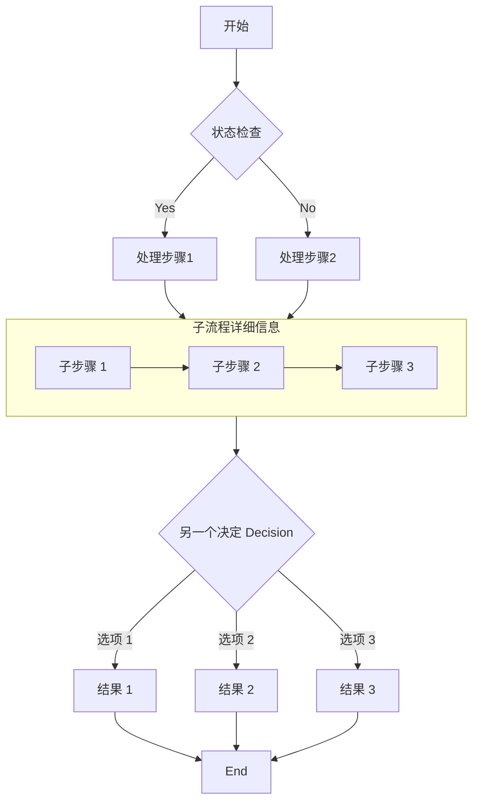
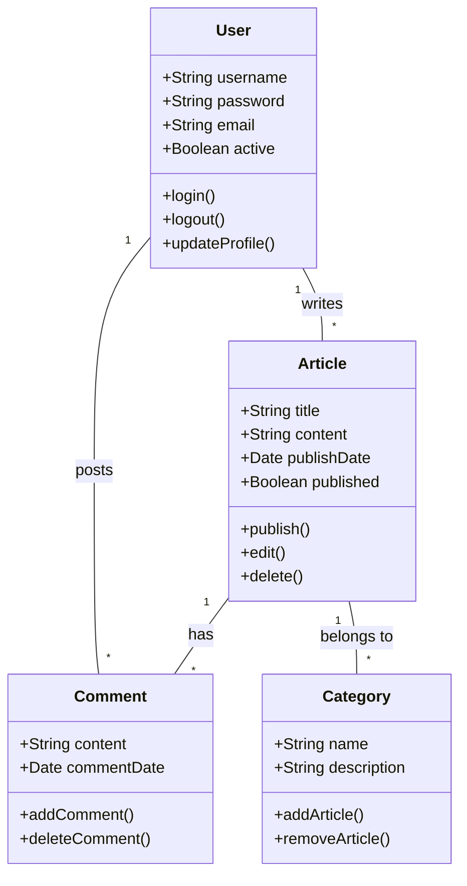
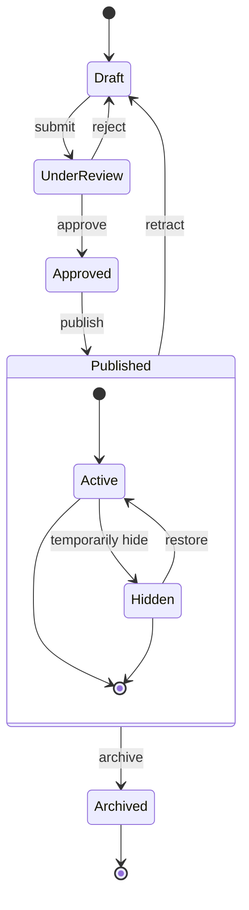
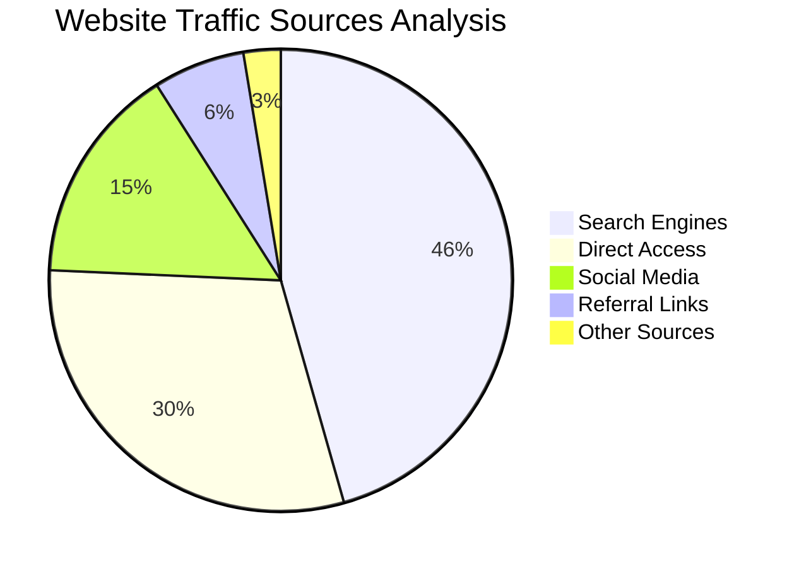

---
#  true false
title: Markdown扩展功能 # 标题
published: 2025-12-12T04:40:26.381Z # 发布日期
updated: 2025-11-14 #更新日期
description: 一个使用Mermaid的Markdown博客文章的简单示例 # 描述 
#encrypted: true # 加密
#password: "123456" # 密码
#alias: "加密示例" # 别名
#pinned: true # 置顶
#priority: 0 # 置顶优先级,数字越小优先级越高(0、1、2...)
#image: ./cover.jpg # 封面图片路径。<br/>1。以“http://”或“https://”开头：使用网络图像<br/>2。以“/”开头：用于“public”目录中的图像<br/>3。没有前缀：相对于markdown文件
tags: [Markdown，博客，Markdown] # 标签
category: 示例 # 类别
#licenseName: "未经许可" # 许可证名称 不使用时默认为 CC BY-NC-SA 4.0
#author: 原作者 # 作者 引用别人的文章时使用
#sourceLink: "https://github.com/emn178/markdown" # 源链接 引用别人的文章时使用
draft: false # 草稿 如果这篇文章仍然是草稿，则不会显
---
# 使用Mermaid完成Markdown指南

本文演示了如何在Markdown文档中使用Mermaid创建各种复杂的图表，包括流程图、序列图、甘特图、类图和状态图.




## 序列图示例

序列图显示了对象之间随时间的交互.

```mermaid
顺序图
    参与者用户
    参与者WebApp
    参与者服务器
    参与者数据库

    用户->>WebApp: 提交登录请求
    WebApp->>服务器：发送身份验证请求
    服务器->>数据库：查询用户凭据
    数据库-->>服务器：返回用户数据
    服务器-->>WebApp: 返回认证结果

    身份验证成功
        WebApp->用户：显示欢迎页面
        WebApp->>服务器：请求用户数据
        服务器->>数据库：获取用户首选项
        数据库-->>服务器：返回首选项
        服务器-->>WebApp: 返回用户数据
        WebApp->>用户：加载个性化界面
    否则身份验证失败
        WebApp->>用户：显示错误消息
        WebApp->>用户：提示重新输入
    结束
```

## Gantt 图表示例

Gantt 图非常适合显示项目进度和时间线

```mermaid
gantt
    标题网站开发项目时间表
    日期格式  YYYY-MM-DD
    axisFormat  %m/%d
    
    设计阶段
    需求分析:   a1, 2023-10-01, 7d
    UI设计:     a2, after a1, 10d
    原型创建:   a3, after a2, 5d
    
    开发阶段
    前端开发:   b1, 2023-10-20, 15d
    后端开发:   b2, after a2, 18d
    数据库设计: b3, after a1, 12d
    
    测试阶段
    单元测试:       c1, after b1, 8d
    集成测试:       c2, after b2, 10d
    用户验收测试:   c3, after c2, 7d
    
    部分部署
    生产部署:   d1, after c3, 3d
    发布:       里程碑, after d1, 0d
```

## 类图示例

类图显示了系统的静态结构，包括类、属性、方法及其关系



## State Diagram Example

State diagrams show the sequence of states an object goes through during its life cycle.



## Pie Chart Example

Pie charts are ideal for displaying proportions and percentage data.



## 结论

Mermaid是一个强大的工具，用于在Markdown文档中创建各种类型的图表
本文演示了如何使用 flowcharts, sequence diagrams, Gantt charts, class diagrams, state diagrams, 和 pie charts. 
这些图表可以帮助您更清楚地表达复杂的概念、流程和数据结构

要使用Mermaid，只需在代码块中指定Mermaid语言，并使用简洁的文本语法描述图表。Mermaid会自动将这些描述转换为美丽的视觉图表。

在你的下一篇技术博客文章或项目文档中尝试使用Mermaid图 - 他们会让你的内容更专业，更容易理解！